# DevOps Final Project — Secure, Automated & Reliable Delivery

A production-style DevOps project for a Node.js / Express web application. It
extends the midterm (CI, IaC automation, blue-green deployment, rollback,
monitoring) and **consolidates every feature built across the semester** into a
single reproducible stack, then hardens it with **environment automation,
security automation, reliability improvements, and a stronger CI/CD pipeline**.

**Repository:** `https://github.com/Taso007/DevOps_Midterm`

> **One command to run everything:**
> ```bash
> docker compose up -d --build      # or: ./scripts/bootstrap.sh  (bash)
> ```                                #     .\scripts\bootstrap.ps1 (Windows)

---

## Table of Contents

1. [What was carried forward](#what-was-carried-forward)
2. [Architecture](#architecture)
3. [Tech stack](#tech-stack)
4. [Repository structure](#repository-structure)
5. [Environment setup (single command)](#environment-setup)
6. [Deployment workflow](#deployment-workflow)
7. [Security implementation](#security-implementation)
8. [Monitoring, logging & observability](#monitoring-logging--observability)
9. [Reliability improvements](#reliability-improvements)
10. [Automation improvements](#automation-improvements)
11. [Application endpoints](#application-endpoints)
12. [Branching strategy](#branching-strategy)
13. [Screenshots](#screenshots)

---

## What was carried forward

This project intentionally keeps **all previously implemented functionality
fully operational** and merges three assignments into one solution:

| Source | Feature | Where it lives now |
|--------|---------|--------------------|
| Assignment 1 | CI + **Feature Flag** release strategy | `.github/workflows/ci.yml`, `featureFlags.js`, `/` route |
| Assignment 2 | **Docker Compose**, **Prometheus + Grafana**, **ELK logging**, **alerting** | `docker-compose.yml`, `prometheus/`, `grafana/`, `logstash/` |
| Midterm | **Blue-green deployment**, **rollback**, **IaC automation**, health checks, reverse proxy | `deploy.py`, `rollback.py`, `setup.py`, `proxy.js`, `/health` |

Everything above still works, and the new requirements are layered on top.

---

## Architecture

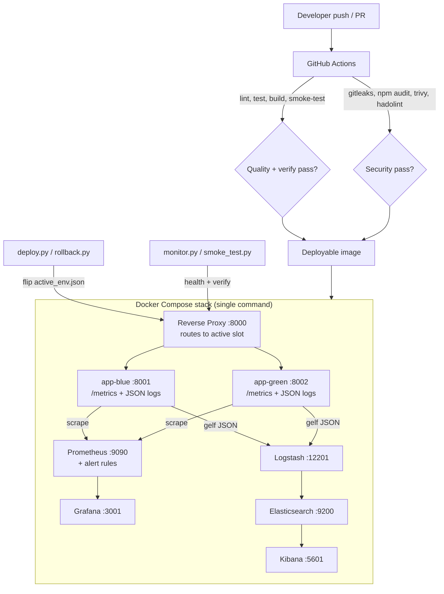

**Traffic flow:** a single reverse proxy on `:8000` is the public entrypoint and
forwards to whichever slot (`app-blue` or `app-green`) is marked active in
`config/active_env.json`. `deploy.py` and `rollback.py` switch traffic by
flipping that file — the proxy honours it live, with no restart, in **both**
local and Docker modes.

---

## Tech stack

| Category | Tools |
|---|---|
| Application | Node.js 20, Express |
| Metrics / logging libs | `prom-client`, `pino` |
| Testing / linting | Jest, Supertest, ESLint |
| Containers | Docker, Docker Compose |
| Metrics & dashboards | Prometheus, Grafana |
| Logging (ELK) | Elasticsearch, Logstash, Kibana |
| IaC / automation | Python 3 (`setup.py`, `deploy.py`, `rollback.py`, `monitor.py`, `validate_env.py`, `smoke_test.py`) |
| CI/CD | GitHub Actions |
| Security | Gitleaks, npm audit, Trivy (image/fs/config), Hadolint |
| Reverse proxy | Node `http-proxy` |

---

## Repository structure

```
DevOps_Midterm/
├── app.js                     # Express app: routes + metrics + JSON logging + feature flag
├── server.js                  # App entrypoint
├── proxy.js                   # Reverse proxy (local + Docker modes)
├── featureFlags.js            # Feature-flag helper (Assignment 1)
├── app.test.js                # Jest/Supertest tests (incl. /metrics, /error)
├── Dockerfile                 # Hardened multi-stage, non-root, healthcheck
├── .dockerignore
├── docker-compose.yml         # Full stack: blue/green app, proxy, Prometheus, Grafana, ELK
├── .env.example               # Config/secrets template (real .env is git-ignored)
├── Makefile                   # Convenience targets (setup/up/test/security/deploy…)
├── setup.py                   # Local IaC environment setup
├── validate_env.py            # Environment validation (tools, files, ports, compose)
├── deploy.py                  # Blue-green deploy + auto post-deploy verification + auto-rollback
├── rollback.py                # Safe rollback with health gate
├── monitor.py                 # Continuous health monitor -> logs/health.log
├── smoke_test.py              # Deployment verification (used by bootstrap, deploy, CI)
├── config/active_env.json     # Active slot (drives the proxy)
├── prometheus/
│   ├── prometheus.yml         # Scrape config (blue + green)
│   └── alerts.yml             # Availability, error-rate & latency alerts
├── grafana/provisioning/      # Datasource + dashboard (auto-provisioned)
├── logstash/pipeline/         # JSON log parsing pipeline
├── scripts/
│   ├── bootstrap.sh           # One-command setup (bash)
│   ├── bootstrap.ps1          # One-command setup (PowerShell)
│   └── security_scan.sh       # Full local security scan via Docker
├── docs/
│   ├── RUNBOOK.md             # Incident response runbook
│   └── SLO.md                 # Service level objectives
├── .github/workflows/
│   ├── ci.yml                 # Lint, test, build, deployment verification
│   └── security.yml           # Secrets, deps, Dockerfile, IaC & image scanning
├── logs/                      # Health-monitor logs
└── screenshots/               # Evidence
```

---

## Environment setup

> **Requirements:** Docker + Docker Compose (Docker Desktop on Windows/macOS).
> Node.js and Python are only needed for the optional *local* (non-Docker) mode.
> No paid services — everything runs locally with free, open-source tools.

### Option A — Full stack with one command (recommended)

```bash
git clone https://github.com/Taso007/DevOps_Midterm.git
cd DevOps_Midterm

# bash / Linux / macOS / Git-Bash
./scripts/bootstrap.sh

# Windows PowerShell
.\scripts\bootstrap.ps1
```

The bootstrap script is fully automated and reproducible:
1. creates `.env` from `.env.example` if missing,
2. runs `validate_env.py` (checks tools, required files, ports, and validates the compose file),
3. `docker compose up -d --build`,
4. runs `smoke_test.py` to **verify** the deployment.

Or skip the wrapper and run the single command directly:

```bash
docker compose up -d --build
```

Give the stack ~1–2 minutes (Elasticsearch/Kibana are slowest), then open:

| Service | URL | Credentials |
|---------|-----|-------------|
| App (via proxy) | http://localhost:8000 | – |
| app-blue / app-green | http://localhost:8001 / http://localhost:8002 | – |
| Prometheus | http://localhost:9090 | – |
| Grafana | http://localhost:3001 | `admin` / `admin` (override in `.env`) |
| Kibana | http://localhost:5601 | – |
| Elasticsearch | http://localhost:9200 | – |

```bash
docker compose ps          # check container + health status
docker compose down        # stop (keep data)
docker compose down -v     # stop + remove volumes
```

### Option B — Local mode (no Docker)

```bash
python setup.py            # creates dirs, .env, config; runs npm install
node proxy.js              # reverse proxy on :8000  (terminal 1)
python deploy.py           # starts an app slot + verifies + switches traffic (terminal 2)
python monitor.py          # continuous health monitoring (terminal 3)
```

---

## Deployment workflow

The project uses a **blue-green** strategy: two identical instances (`blue` on
8001, `green` on 8002) run in parallel and the proxy serves only the active one.

```bash
python deploy.py     # deploy to the inactive slot, verify, then switch traffic
python rollback.py   # instantly revert traffic to the previous slot
```

`deploy.py` now performs a **fully automated, verified deployment**:

1. Detects the inactive slot and starts the new version there.
2. Health-checks the new instance (5 attempts against `/health`).
3. Flips `config/active_env.json` so the proxy sends live traffic to it.
4. **Post-deployment verification** — runs `smoke_test.py` through the proxy.
5. **Auto-rollback** — if verification fails, it automatically restores the
   previous slot so users never see the broken release.

In Docker mode both slots are always running, so a deploy/rollback is just the
instant config flip that the proxy honours live.

---

## Security implementation

Security is automated and integrated into the pipeline ([`security.yml`](.github/workflows/security.yml))
and reproducible locally ([`scripts/security_scan.sh`](scripts/security_scan.sh)).
All tools are free and open-source.

| Area | Tool | What it does | Gating? |
|------|------|--------------|---------|
| **Secrets scanning** | Gitleaks | Scans the tree for committed secrets/keys (`.gitleaks.toml`) | blocks |
| **Dependency scanning** | `npm audit` | Fails on HIGH+ vulns in production deps | blocks |
| **Dockerfile security** | Hadolint | Lints the Dockerfile for unsafe practices | blocks |
| **IaC / config scanning** | Trivy `config` | Misconfigurations in Dockerfile / compose / YAML | blocks (HIGH,CRITICAL) |
| **Filesystem scanning** | Trivy `fs` | Vulnerable deps + leaked secrets | report |
| **Container image scanning** | Trivy `image` | CVEs in the built image | report |

**Other security measures built in:**

- **Secrets management** — no secrets in git. Configuration lives in `.env`
  (git-ignored); only the non-secret `.env.example` template is committed.
  Grafana credentials and the feature flag are injected via environment.
- **Hardened container** — multi-stage build, production-only dependencies
  (`npm ci --omit=dev`), runs as the **non-root** `node` user, minimal
  `node:20-alpine` base, and a built-in `HEALTHCHECK`.
- **Applied fix demonstrated** — `npm audit fix` reduced the dependency tree
  from 5 known vulnerabilities to **0** while keeping all tests green.

Run the whole suite locally (everything runs as throwaway Docker containers, no
installs needed):

```bash
bash scripts/security_scan.sh        # or: make security
```

> **Windows:** run this from a **Git Bash** shell — in PowerShell a bare `bash`
> launches WSL, not Git Bash. From PowerShell you can call Git Bash directly:
> `& "C:\Program Files\Git\bin\bash.exe" scripts/security_scan.sh`

> **Gating policy:** secrets, dependency (HIGH+), Dockerfile and IaC
> misconfiguration findings **fail the pipeline**. Image/filesystem CVE scans are
> *report-only* so a freshly-disclosed upstream base-image CVE alerts the team
> without blocking every unrelated deploy — a deliberate, production-sane choice.

---

## Monitoring, logging & observability

### Metrics (Prometheus + Grafana)

The app exposes Prometheus metrics at `/metrics` via `prom-client`:

| Metric | Type | Meaning |
|--------|------|---------|
| `app_requests_total` | Counter | Every HTTP request (`method`, `path`, `status_code`) |
| `app_errors_total` | Counter | Errors (`/error` + unhandled), labelled by `path` |
| `app_request_duration_seconds` | Histogram | Request latency (drives p95 SLO) |
| Node.js defaults | – | CPU, memory, event-loop, GC |

Prometheus scrapes **both** slots (labelled `slot=blue|green`). Grafana
auto-provisions a datasource and the **"DevOps Final — App Dashboard"** with
panels for instance up/down, requests, error rate, request rate, and p95 latency.

### Logging (ELK)

- The app emits **one structured JSON log object per line** to stdout (`pino`):
  `timestamp, level, service, method, path, statusCode, message`.
- Docker's **gelf** logging driver ships each line to **Logstash** (UDP 12201).
- Logstash parses the JSON into searchable `app.*` fields and writes daily
  indices `app-logs-YYYY.MM.dd` to **Elasticsearch**.
- Explore in **Kibana** (data view `app-logs-*`), e.g. `app.statusCode: 500`.

### Alerting

Prometheus rules in [`prometheus/alerts.yml`](prometheus/alerts.yml):

| Alert | Severity | Fires when |
|-------|----------|-----------|
| `AppInstanceDown` | CRITICAL | a slot stops being scrapeable for 30s |
| `AllInstancesDown` | CRITICAL | both slots are down (full outage) |
| `CriticalHighErrorRate` | CRITICAL | > 5 errors in one minute |
| `ElevatedErrorRate` | WARNING | sustained error rate for 2m |
| `HighRequestLatencyP95` | WARNING | p95 latency > 500ms for 2m |

**Trigger the critical alert (demo):**

```bash
# bash
for i in $(seq 1 10); do curl -s http://localhost:8000/error > /dev/null; done
# PowerShell
1..10 | ForEach-Object { curl.exe http://localhost:8000/error }
```

Within ~30s `CriticalHighErrorRate` moves to **Firing** in Prometheus
(http://localhost:9090/alerts) and is visible in Grafana.

---

## Reliability improvements

- **Service health monitoring** — `/health` endpoint, Docker `HEALTHCHECK` on the
  app and proxy, and `monitor.py` continuously logging to `logs/health.log`.
- **Rollback procedure** — `rollback.py` reverts traffic instantly and includes a
  **safety health gate** that refuses to roll onto an unhealthy slot.
- **Failure-recovery automation** — `deploy.py` auto-rolls-back when
  post-deployment verification fails; all containers use `restart: unless-stopped`.
- **Improved alerting strategy** — added availability and latency alerts plus
  WARNING-before-CRITICAL tiers (see table above), backed by SLOs.
- **Service availability objectives** — documented in [`docs/SLO.md`](docs/SLO.md)
  (99.5% availability, p95 < 500ms, error budget policy).
- **Incident response documentation** — [`docs/RUNBOOK.md`](docs/RUNBOOK.md):
  detection → triage → recovery → verification → post-incident.

---

## Automation improvements

- **One-command environment preparation** — `scripts/bootstrap.{sh,ps1}` /
  `make setup` (validate → build → start → verify).
- **Automated environment validation** — `validate_env.py` checks tools, files,
  ports, and validates the compose definition before anything starts.
- **Deployment verification** — `smoke_test.py` probes every critical endpoint;
  used by bootstrap, by `deploy.py` post-deploy, and inside CI against the freshly
  built image.
- **Stronger CI/CD** ([`ci.yml`](.github/workflows/ci.yml)):
  1. **quality** — lint + unit tests on Node 18 & 20,
  2. **build-and-verify** — build the Docker image, run it, and smoke-test it
     before it is considered deployable.
- **Dedicated security pipeline** ([`security.yml`](.github/workflows/security.yml))
  runs on every push/PR **and weekly** to catch newly-disclosed CVEs.

---

## Application endpoints

| Method | Route | Description |
|--------|-------|-------------|
| `GET` | `/` | Homepage (feature-flagged UI via `NEW_UI_ENABLED`) |
| `GET` | `/user/:name` | Dynamic route — greets the user |
| `POST` | `/submit` | Processes and echoes submitted data |
| `GET` | `/health` | Health check (status, env, uptime, timestamp) |
| `GET` | `/logs` | View the health-monitor log in the browser |
| `GET` | `/metrics` | Prometheus metrics |
| `GET` | `/error` | Deliberate 500 (drives the alerting demo) |

---

## Branching strategy

| Branch | Purpose |
|--------|---------|
| `main` | Stable production code |
| `dev` | Active development and testing |

All changes are developed on `dev` and merged into `main` via Pull Request after
the CI **and** Security workflows pass.

---

## Screenshots

### CI/CD & deployment
| | |
|---|---|
| GitHub Actions CI success | 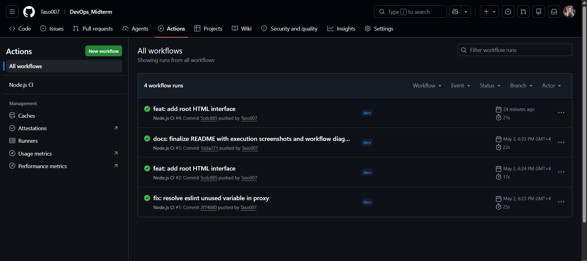 |
| Successful deployment | 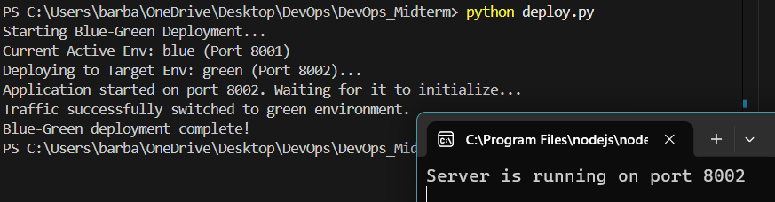 |
| Aborted/failed deployment | 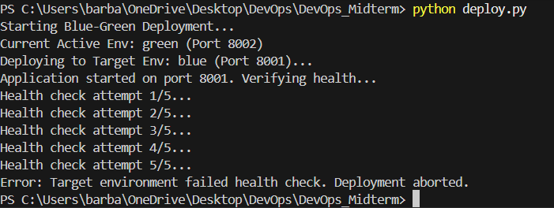 |
| Rollback output | 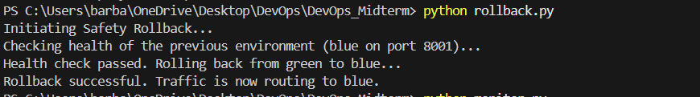 |
| Automated environment setup | 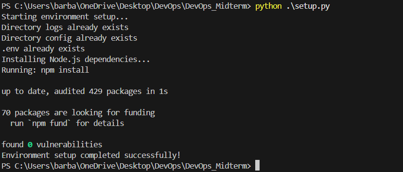 |
| Tests passing | 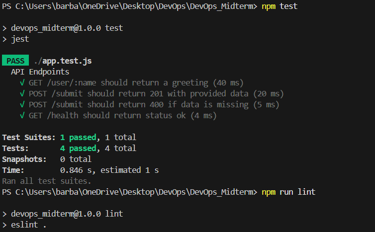 |

### Monitoring, logging & alerting
| | |
|---|---|
| Grafana dashboard | 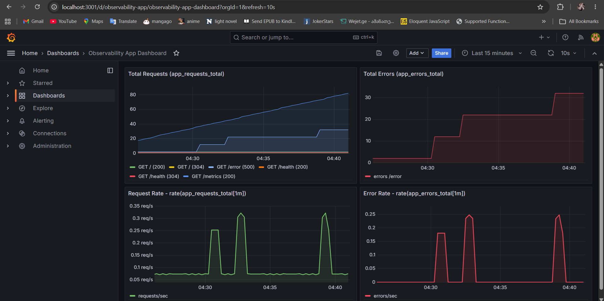 |
| Kibana structured JSON logs | 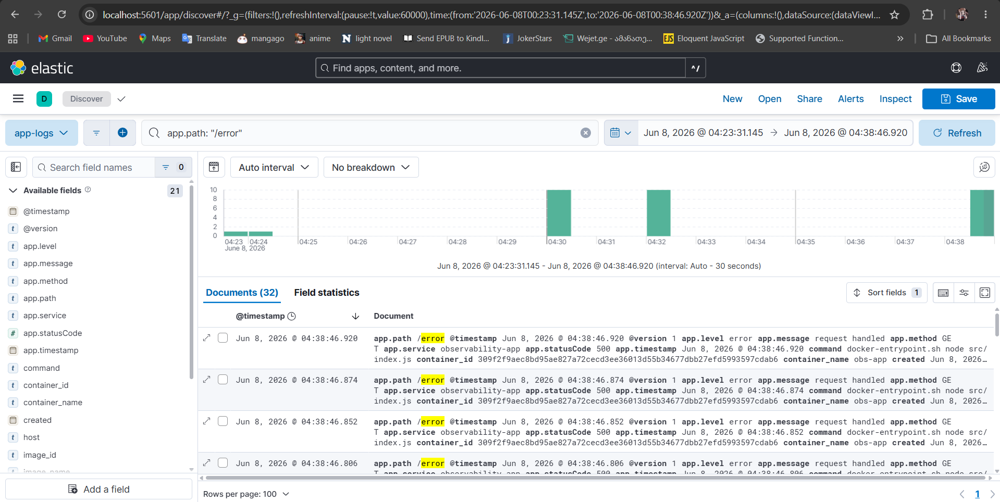 |
| Prometheus/Grafana alert firing | 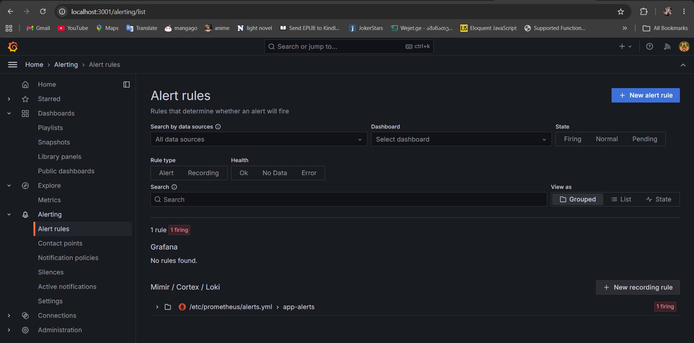 |
| Prometheus alerts page — `CriticalHighErrorRate` firing | 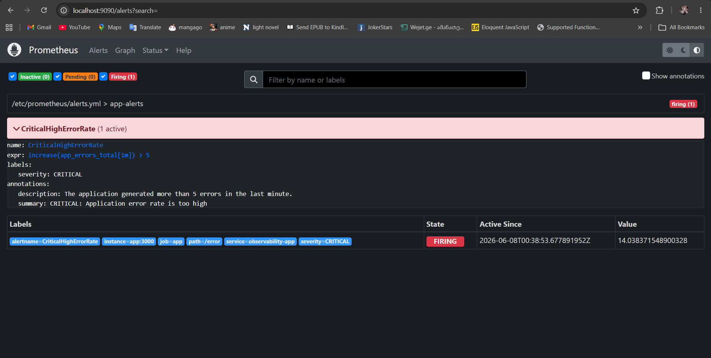 |
| Alert (inactive) | 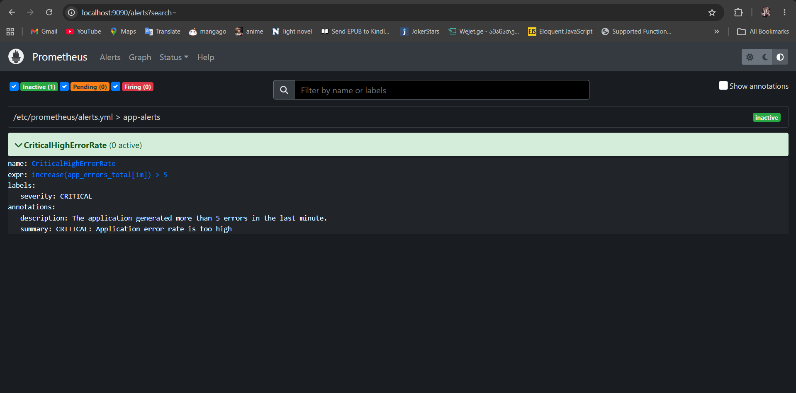 |
| Health monitor logs | 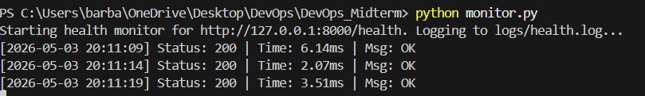 |
| Health log output (`logs/health.log`) | 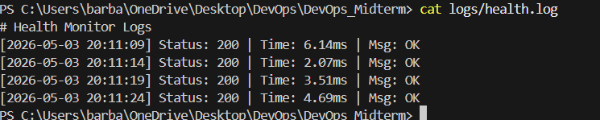 |

### Application
| | |
|---|---|
| Homepage / blue-green | 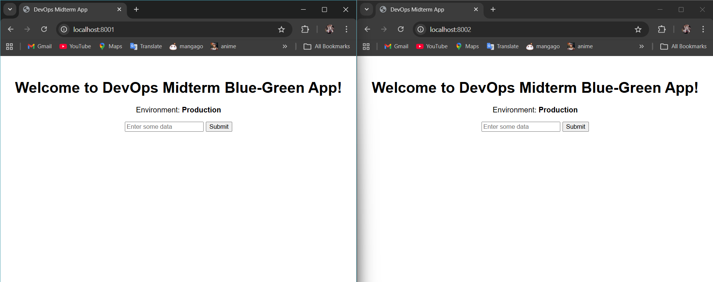 |
| Form submission | 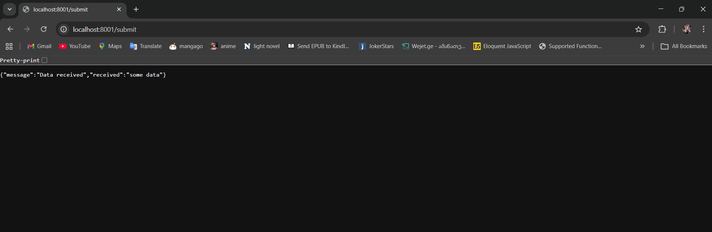 |
| Dynamic route | 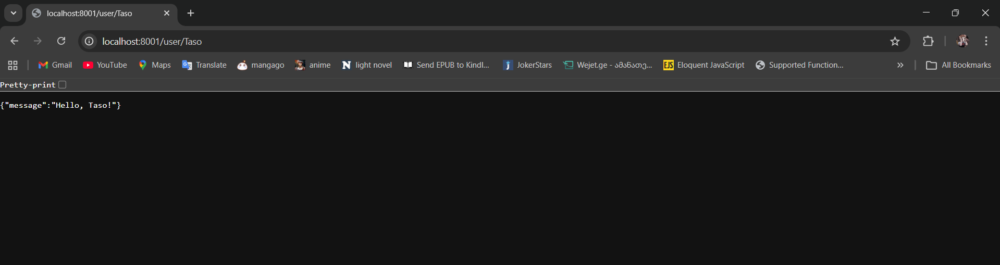 |
| Health endpoint | 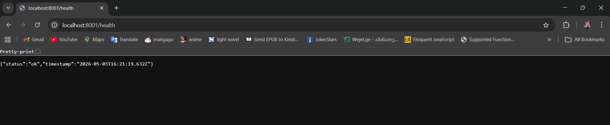 |
| Browser logs view | 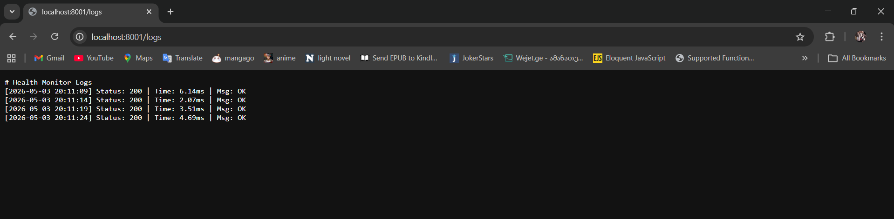 |

### Security 
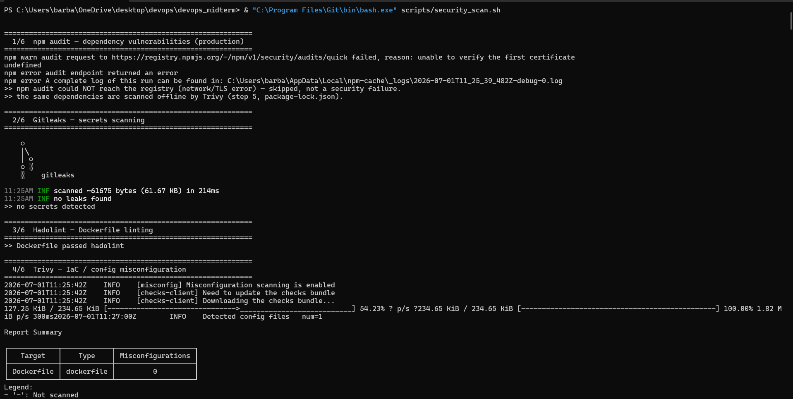
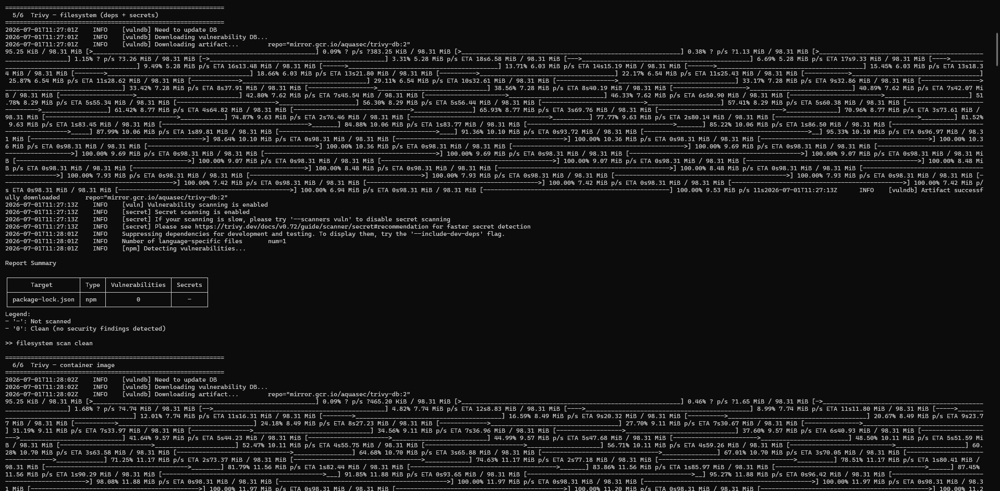
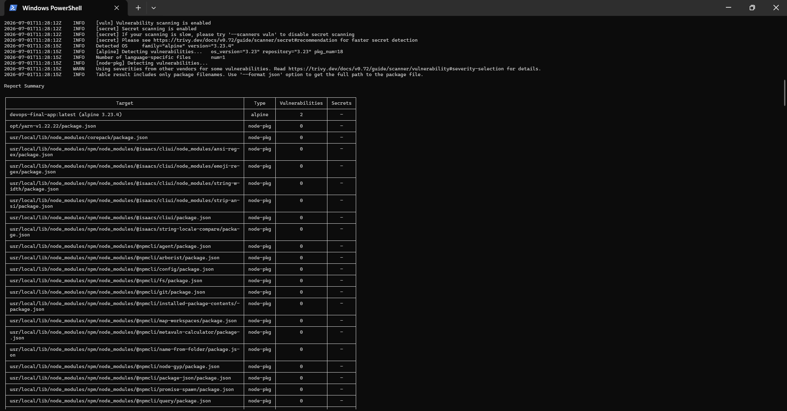
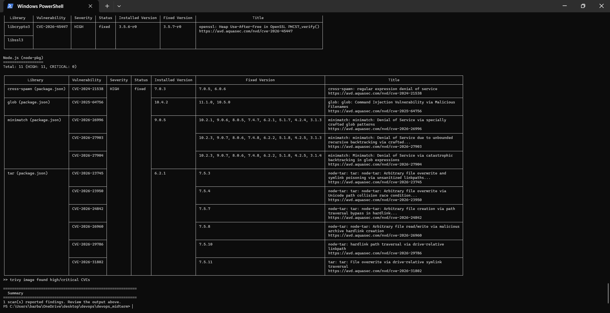

### Docker health 
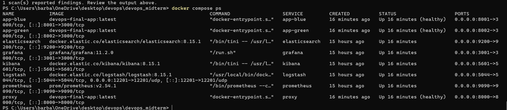

